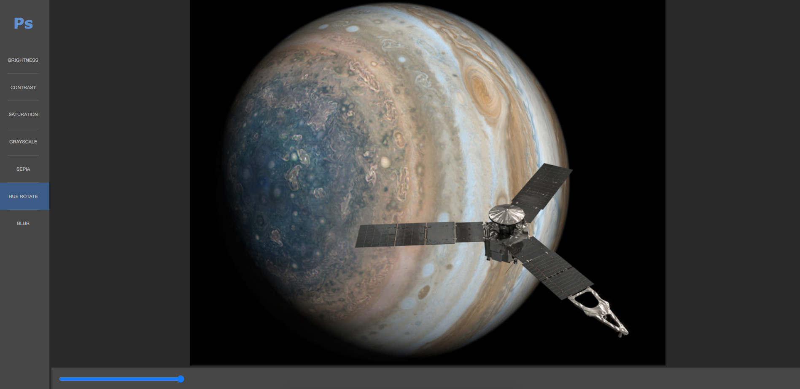

# Photoshock
A basic photo editor built with React that lets you change an image's graphic properties.



## Table of Contents

* [Features](#features)
* [Installation](#installation)
* [Built With](#built-with)
* [Contributing](#contributing)
* [Acknowledgments](#acknowledgments)
* [Authors](#author)
* [License](#license)

## Features
A user can change image's following values:
- Brightness
- Contrast
- Saturation
- Hue rotation

And can also apply the following filters:

- Blur filter
- Grayscale filter
- Sepia filter

## Installation

You can get a local copy of the repository please run the following commands on your terminal:
```
$ cd <folder>
$ git clone git@github.com:dansantander/photoshock.git
```

## Built With
- React
- React Hooks
- JavaScript
- HTML
- CSS

## Contributing

Contributions, issues and feature requests are welcome!

You can do it on [issues page](issues/).

## Acknowledgments

Special thanks to code reviewers.

## Show your support

Give a ⭐️ if you like this project!

## Authors

👤 **Daniel Santander**

- Github: [@dansantander](https://github.com/dansantander)
- Linkedin: [Daniel Santander](https://www.linkedin.com/in/daniel-santander)
- Twitter: [@dansantandr](https://twitter.com/dansantandr)

## License

<strong>Creative Commons 2020</strong>
